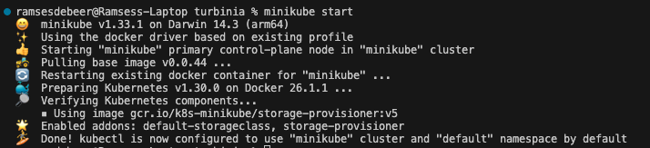

# Develop local with VSCode and Minikube

## Introduction
This document will describe how to setup a local development environment using VSCode as the IDE,  Minikube as the k8s cluster to run Turbinia and Skaffold to handle the development cycle. 

This setup will provide run time debugging with breakpoints/watches in VSCode as well as hot-reloading of code changes to the live Turbinia deployment without having to rebuild the containers or restart the deployment.

---
NOTE: This setup has been tested by the Turbinia developers in the following configurations.
* MacAir M3 8GB with Docker Desktop
* GCE (e2-standard-4) Debian 12/bookworm 16GB with Docker Engine (Running on GCP using the [VSCode Remote SSH extension](https://marketplace.visualstudio.com/items?itemName=ms-vscode-remote.remote-ssh))
   * Setting up the VSCode Remote-SSH extension is outside of scope for this documentation but more information can be found [here](https://code.visualstudio.com/docs/remote/ssh).
   * NOTE: The GCE machine is used as a local machine running in GCP where you will install minikube and the other dependencies on.
* If you want to develop with a full VSCode web interface you can use the [GCP Cloud Shell Editor](https://shell.cloud.google.com/)
   * This setup has all the dependecies and VSCode extensions neeeded for Turbinia development pre-installed and configured. You can continue the setup at the section [here](#start-minkube-cluster).
   * Take note of the limitations [here](https://cloud.google.com/shell/docs/quotas-limits)
   * If the limitations are an issue for you, have a look into the (paid) version called [Google Cloud Workstation](https://cloud.google.com/workstations/).

## Components
### Minikube
As the main supported way to run Turbinia is on k8s it makes sense to also develop as close to a production setup as possible. [Minikube](https://minikube.sigs.k8s.io/docs/) is local Kubernetes cluster so you can run the complete Turbinia stack from your laptop.

### Skaffold
[Skaffold](https://skaffold.dev/) is a development workflow manager that takes care of building and deploying and monitoring for code changes so you can focus on writing code instead of manually building or restarting containers after every code change.

### VSCode + [Gemini Code Assist/Google Cloud Code extension](https://marketplace.visualstudio.com/items?itemName=GoogleCloudTools.cloudcode)
VSCode is an IDE that combined with the Google Cloud Code extension will manage the dependencies needed for the development workflow and provide an interface to debug through breakpoints and watches. The extension will manage minikube, skaffold, kubectl and their setup and configuration in a seperate folder as not to interfere with your system configuration.

NOTE: Gemini Code Assist is disabled by default and can be enabled through the extension setting Cloudcode -> Duet AI -> Enable. This will give you LLM supported code advice. See [here](https://cloud.google.com/products/gemini/code-assist?hl=en) for further details about Gemini Code Assist.

---
## Setup
### Requirements
Please install the following requirements on your system.
* [Docker](https://docs.docker.com/engine/install/), you can install Docker Desktop or only the engine.
   * Make sure docker can be execute as non-root (`docker run hello-world`). See [here](https://docs.docker.com/engine/install/linux-postinstall/) for instructions.
   * Some operating systems can run Minikube (faster) with other hypervisors. If you choose so expect some extra custom setup to be done. We advice the use of Docker for Minikube.
* [Helm](https://helm.sh/docs/intro/install/), to manage the deployment of Turbinia.
* [VSCode](https://code.visualstudio.com/Download), our IDE of choice for this setup.

### Configure VSCode
Start VSCode and install the following extensions:
* [Python](https://marketplace.visualstudio.com/items?itemName=ms-python.python)
* [Gemini Code Assist + Google Cloud Code](https://marketplace.visualstudio.com/items?itemName=GoogleCloudTools.cloudcode)

Restart VSCode. Once VSCode has restarted let's install the development dependencies (minikube, skaffold and kubectl). We will let the Google Cloud Code extension manage the dependencies and they will be installed in a seperate folder, not in your system folders. In VSCode:
 * Control-Shift-P (or Command-Shift-P on Macs) to open the command menu
 * Choose `Cloud Code:  Control Minikube`
 * Choose `Continue with Managed dependencies`

This will have VSCode install the dependencies (minikube, skaffold and kubectl) and it can take a while.

### Start Minkube cluster
We will now start the minikube k8s cluster
 * Control-Shift-P (or Command-Shift-P on Macs) to open the command menu
 * Choose `Cloud Code:  Control Minikube`
 * Choose `Start` 

NOTE: If you want to change the default cluster CPU and Memory usage, you can set those before starting the cluster

    minikube config set cpus 4
    minikube config set memory 16384

### Turbinia source and deployment code 
Now we have VSCode setup we are going to get a copy of the Turbinia source and deployment code.
Clone the [Turbinia repository](https://github.com/google/turbinia) by forking the Turbinia repository into your own Github account and clone it locally from there.

    git clone ssh://git@github.com:[YOUR_GITHUB_ACCOUNT]/turbinia.git

Let's get the helm charts for the Turbinia deployment. In your cloned turbinia repository

    mkdir charts && cd charts
    helm repo add osdfir-charts https://google.github.io/osdfir-infrastructure
    helm pull osdfir-charts/turbinia --untar && cd ..

Open up the turbinia folder in VSCode.

### Prepare Cluster
Open a terminal (inside VSCode is the easiest, but any terminal will do) and let's configure skaffold, the local cluster and the additional helm repository for Redis.

    skaffold config set --global local-cluster true
    eval $(minikube -p minikube docker-env)
    helm repo add bitnami https://charts.bitnami.com/bitnami
    helm repo add kube-prometheus-stack https://prometheus-community.github.io/helm-charts

### Verify Setup
Execute a build with skaffold (from the root of the cloned Turbinia Github repository)

    skaffold build

This will build a Turbinia Server container image succesfully if skaffold has been correctlty setup and configured as described above.

### Install the Turbinia Client
We will install the Turbinia client into a Python virtual environment to be able to control Turbinia during our development workflow.

    python -m venv .venv (or use your favorite virtual env manager)
    source .venv/bin/activate
    pip install poetry
    cd turbinia/api/cli
    poetry install

Create the Turbinia Client configuration file in `$HOME/.turbinia_api_config.json` using the base configuration from [here](
https://pypi.org/project/turbinia-client/).

### Run
Now we are ready to run the development cluster of Turbinia. This will startup the Turbinia API server, the worker and the server in the local minikube k8s cluster.

    skaffold dev

NOTE: if one of the services fails to deploy, try again. Sometimes a time-out occurs due to Redis starting too slow.

The Turbinia WebUI should now be available on http://localhost:8000.

### Verify debugging and hot-reloading
#### Debugging
The Turbinia containers are started with the python debugger enabled and listening on port 10000 (worker) and 20000 (server). VSCode launch debug configurations have been provided.

While the cluster is running in development mode with skaffold you can use those launch configuration to connect to the worker and server (yes, at the same time if you want that!), set breakpoints and inspect watches.

#### Hot-reloading
Hot reloading has been enabled through the python `jurigged` [module](https://github.com/breuleux/jurigged) and will monitor for any change on the `/home/turbinia` folder in the containers. When you change a file in VSCode, skaffold will sync that file into the container and `jurigged` will hot reload that file into the running process.

NOTE: As python hot reloading of code into an already running process is tricky it may not work in all cases (see Caveats section [here](https://github.com/breuleux/jurigged?tab=readme-ov-file)). If that happens let skaffold rebuild the container by touching the `skaffold.yaml`file.

Keep in mind that hot-reloading:
* will load a changed Python source code file as Python byte code in memory of a running process
* will not re-execute any change code automatically
* means that you need to execute something to trigger the code path and code you changed and was hot reloaded

## Test Run
Let's test the whole setup by executing a request with a disk image located at `test_data/artifact_disk.dd`.

Copy the disk to one of the containers in the shared `/mnt/turbiniavolume` folder.

    kubectl cp artifact_disk.dd dev-release-turbinia-server-6d6:/mnt/turbiniavolume/

Start a Turbinia rawdisk request.

    turbinia-client submit rawdisk --source_path /mnt/turbiniavolume/artifact_disk.dd
   
    Sending request: {'evidence': {'type': 'RawDisk', 'source_path': '/mnt/turbiniavolume/artifact_disk.dd'}, 'request_options': {}} 
    Received response: {'request_id': '4d76df84849c484a835d37fbc7668122'}

You can check the Turbinia WebUI at http://localhost:8000 or use the turbinia-client to verify the status of the request.

    turbinia-client status request 4d76df84849c484a835d37fbc7668122

### Next
Try our Turbinia minikube development 101 Codelab [here](turbinia-codelab-analyser.md)

### Cleanup development environment
* Remove all minikube clusters `minikube delete --all --purge`
* Remove all images/containers/volumes from Docker `docker system prune -a`
* Remove the Google Cloud Code Extension from VSCode

### Troubleshooting and Tips
#### Google Cloud Code tools not found (minikube, skaffold, kubectl)
The extension will add the PATH automatically to your config. But if you have a different or custom shell configuration this may fail. Add the path manually to your PATH.
* Linux: `$HOME/.cache/cloud-code/installer/google-cloud-sdk/bin`
* Mac: `$HOME/Library/Application Support/cloud-code/installer/google-cloud-sdk/bin`
#### Installing K9s
Install [k9s](https://k9scli.io/) to easily manage your k8s cluster (eg logs and shells into pods)
#### skaffold commands  
* Enable more debugging info with `skaffold dev -v debug`
#### minikube commands
* Status `minikube status`
* Stop `minikube stop`
* Purge clusters to start over `minikube delete --all --purge`
#### helm commands
* Remove stale Turbinia cluster `helm list && helm uninstall dev-release`
#### kubectl commands
Advice is to install and use `k9s`(see above) but `kubectl` can be used as well.
* `kubectl get pods`
* `kubctl logs [podname]`
* `kubectl exec -it [podname] -- /bin/bash`
