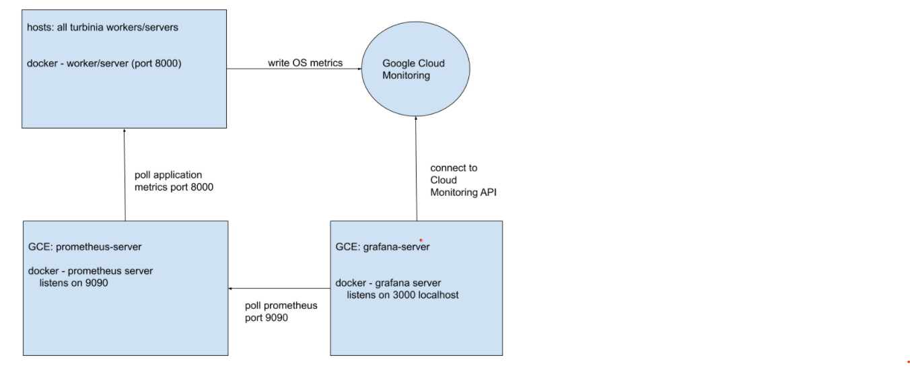

# Turbinia SRE Guide


## Introduction

This document will cover topics to manage Turbinia infrastructure in cloud
and includes Prometheus/Grafana monitoring stack how tos.


## GCP

GCP management script:
[update-gcp-infra.sh](https://github.com/google/turbinia/blob/master/tools/update-gcp-infra.sh)

### Preparation

The GCP stack is managed with the
[update-gcp-infra.sh](https://github.com/google/turbinia/blob/master/tools/update-gcp-infra.sh)
management script. This script can be run from any workstation or cloud shell.

*   Clone the Turbinia repo or
    [download](https://github.com/google/turbinia/blob/master/tools/update-gcp-infra.sh)
    the tool directly.
*   workstation only: Install the
    [gcloud](https://cloud.google.com/sdk/docs/install) cli tool
*   workstation only : Authenticate to your GCP project:
    *   `$ gcloud auth application-default login`
*   workstation only : set the correct GCP project:
    *   `$ gcloud config set project {PROJECT_NAME}`

### Stop and start the Turbinia stack

Turbinia uses [Pub/Sub](https://cloud.google.com/pubsub/docs/overview) to 
distribute jobs and tasks to server and workers. We must first stop the server 
before stopping the workers. Before stopping the server we need to make sure 
the server is not handling any open tasks/requests anymore.

#### Stop infrastructure

*   Check the server logs to see if it's waiting for any tasks to complete:

    *   <code>$ ./update-gcp-infra.sh -i
        {INSTANCEID}
        -z {ZONE} -c logs -s</code>

    ---

    **NOTE** 

    If you are not running from your workstation you can remove the `-s`.

    ---

*   If no tasks are open, shutdown the Turbinia infrastructure. The management
    script will make sure this is done properly.

    *   <code>$ ./update-gcp-infra.sh -i
        {INSTANCEID}
        -z {ZONE} -c stop</code>

    ---
    **NOTE**

    Workers are shut down asynchronously so it will take a while to show
    them as "STOPPED".

    ---

#### Start infrastructure

*   The management script will make sure startup is done in the correct order:

    *   <code>$ ./update-gcp-infra.sh -i
       {INSTANCEID}
        -z {ZONE} -c start</code>

    ---

    **NOTE**

    workers are started up asynchronously so it will take a while to show
    them as "RUNNING".

    ---

*   Check the server and worker logs to see if they came back up as expected.

    *   <code>$ ./update-gcp-infra.sh -i
        {INSTANCEID}
        -z {ZONE} -c logs -s</code>

    ---
    **NOTE** 

    If you are not running from your workstation you can remove the `-s`.

    ---

### Configuration update

The Turbinia configuration is base64 encoded as a metadata value
(TURBINIA\_CONF) attached to the GCE ContainerOS instances. This is written to
disk at boot time and used by the server and worker docker containers. 

Load the new configuration into the Turbinia stack with the following commands:

*   Stop the stack (see [here](#stop-infrastructure)).
*   <code>$ ./update-gcp-infra.sh -i
    {INSTANCEID}
    -z {ZONE} -f [path-to-new-config-file] -c update-config</code>
*   Start the stack (see [here](#start-infrastructure)).

### Environment variable update

The Turbinia stack (including monitoring components) sets some configuration
parameters through containerOS environment variables.

*   Stop the stack (see [here](#stop-infrastructure)).
*   <code>$ ./update-gcp-infra.sh -i
    {INSTANCEID}
    -z {ZONE} -k [env-variable-name] -v [env-variable-value] -c
    update-config</code>
*   Start the stack (see [here](#start-infrastructure)).

### Docker image update

Turbinia runs as a docker image (separate image for server and worker) that are
built and stored in the
osdfir-registry project. When you are ready to release a new version you need 
to reload the Turbinia stack with that new docker image. Please make sure you 
also [update the configuration](#configuration-update) if needed (depending on 
code changes).


#### Update to `latest`

This is the most common scenario. When releasing a new version of Turbinia in
github, a production docker image will be built for both server and worker and
tagged with the `latest` tag.

*   Stop the stack (see [here](#stop-infrastructure)).
*   Start the stack (see [here](#start-infrastructure)).
    *   When starting the stack again ContainerOS will poll the
        `osdfir-registry` and pull the `latest` image of worker and server.
    *   Verify the running version by viewing the server and workers logs.

#### Update the docker tag

Some scenarios require deploying a specific version of Turbinia. Each docker
image is tagged with the actual release tag from github (eg 20210606) and can be
loaded.

*   Stop the stack (see [here](#stop-infrastructure)).
*   Configure a custom tag (instead of `latest`) for server and worker runners
    *   Verify the required tag is actually successfully built and available in
        the registry for both server and worker.
    *   <code>$ ./update-gcp-infra.sh -i
        {INSTANCEID}
        -z {ZONE} -t [tag] -c change-image</code>
*   Start the stack (see [here](#start-infrastructure)).
    *   When starting the stack again ContainerOS will poll the
        <code>osdfir-registry</code> and pull the <code>latest</code> image of
        worker and server.
    *   Verify the running version by viewing the server and workers logs.

### Spin-up more Turbinia workers

Sometimes we need more capacity to process tasks and we want to spin-up new
workers.

*   Go to "VM instances" page under the Compute Engine tab in your cloud project.
*   Filter instances on the current Turbinia instance ID.
    *   Only use the numbers, leave out the 'turbinia-' part.
*   Find the worker with the highest number at the end of the name (eg
    turbinia-worker-1aa1aaaa1a1a1111 **-4**)
*   Open the detail page of that worker.
*   Click the top button "Create Similar".
*   Verify that the "Name" field correctly increased the last number in the name.
*   Scroll down and click "Create".
*   Verify the logs of the new worker for correct instantiation.
    *   <code>$ ./update-gcp-infra.sh -i
        {INSTANCEID}
        -z {ZONE} -c logs -s</code>

    ---
    **NOTE**

    If you are not running from your workstation you can remove the `-s`.

    ---

## Turbinia Metrics setup and management


### Monitoring configuration

In order to interact with the current Turbinia Worker(s) and Server to generate
metrics, you can include the following in Turbinia configuration file:

```
    # Prometheus monitoring config
    PROMETHEUS_ENABLED = True
    PROMETHEUS_ADDR = '0.0.0.0'
    PROMETHEUS_PORT = 9200
```

### GCP setup

The following is the same for both prod and dev cloud projects.


 
Google Monitoring metrics are enabled on all container machines and provide the OS
metrics.

*   `google-monitoring-enabled` set to `true` in GCE configuration of container
    worker/server instances.
*   All Turbinia machines are labeled with 'turbinia-prometheus' for
    auto-discovery by prometheus.

Turbinia server and workers are instrumented with prometheus code and expose
application metrics.

*   each server and worker listens on port 9100 on the private IP only for
    system metrics and port 9200 for application metrics.

#### Prometheus


*   Prometheus will scrape the OS metrics and application metrics from each
    host and expose them on port 9090 for grafana
*   Listens on port 9090
*   Configuration: `/etc/prometheus/prometheus.yml`and
    [here](#prometheus-configuration-gcp)
*   SSH:
    *   `ssh -i ~/.ssh/google_compute_engine -L 11111:localhost:9090
        prometheus-server-1aa1aaaa1a1a1111`
*   Dashboard is on https://localhost:11111/
    *   As the server has a self signed cert, please use 'thisisunsafe' to
        continue past the error message.

##### Prometheus configuration GCP

```
global:
  scrape_interval: 15s # Set the scrape interval to every 15 seconds. Default is every 1 minute.
  # scrape_timeout is set to the global default (10s).
  external_labels:
      environment: turbinia-gcp_node

scrape_configs:
  - job_name: 'turbinia-gcp'
    gce_sd_configs:
        # The GCP Project
        - project: {PROJECT_NAME}
          zone: {ZONE}
          filter: labels.turbinia-prometheus=true
          refresh_interval: 120s
          port: 8000
```

The Turbinia hosts that need to be scraped have the label 'turbinia-prometheus'
set by the Terraform scripts and are auto discovered by Prometheus.

#### Grafana

*   Grafana pulls metrics from Google monitoring (OS metrics) and application
    metrics from Prometheus.
*   Grafana displays dashboard for both the OS and Turbinia application metrics.
*   Datasource 1: Google Monitoring of gcp project
*   Datasource 2: `http://prometheus-server-1aa1aaaa1a1a1111:9090/`
*   Listens on port 3000
*   Current the username is **"admin"** and password is generated by terraform when it 
deploys Grafana.

**WARNING**: You are responsible for securely storing the Grafana admin password after terraform
deployment is complete.

*   SSH access
    *   `ssh -i ~/.ssh/google_compute_engine -L 11111:localhost:3000
        Grafana-server-1aa1aaaa1a1a1111`
*   Dashboard is on https://localhost:11111/
    *   As the server has a self signed cert, please use 'thisisunsafe' to
        continue past the error message


### Importing a new dashboard to Grafana

*   Login to [Grafana](#grafana)
*   Click the “+” sign on the left sidebar and then select “import”.
*   Then copy/paste the json file from the dashboard you want to import and
    click “Load”.

### Exporting a dashboard from Grafana

*   Login to [Grafana](#grafana)
*   From the dashboard, select the “dashboard Setting” on the upper right corner
*   Click on “JSON Model” and copy the contents of the textbox.
*   In order to import this to another dashboard, follow [these steps](#importing-a-new-dashboard-to-grafana).

### How to update prometheus config

To update the prometheus config file or add new rules to prometheus:

*   SSH to the host VM as mentioned [here](#prometheus) .
*   To change the config:
    *   Change and save the contents of `/etc/prometheus/prometheus.yml`
    *   Restart the prometheus container by running `docker restart
        {CONTAINER_ID}`.
        *   To find the container\_id run `docker ps`.
*   To add new prometheus rules:
    *   Create or update an existing rule file. [Prometheus docs](https://prometheus.io/docs/prometheus/latest/configuration/recording_rules)
        have great tips on how to write recording rules.
    *   Update the config file `/etc/prometheus/prometheus.yml` and add the path
        to the rule file under `rule_files` section.
    *   Copy the rule file to the prometheus container by running `docker cp
        prometheus.rules.yml {CONTAINER_ID}:/etc/prometheus/prometheus.rules.yml`
    *   SSH to the prometheus container `docker exec -ti {CONTAINER_ID} sh` and
        check if the rule file is correct by running:
        *    `promtool check rules rule_file_path`
    *   Finally to apply the rules, you need to send a `SIGHUP` signal to
        prometheus process by running:
        *   `killall -HUP prometheus`
