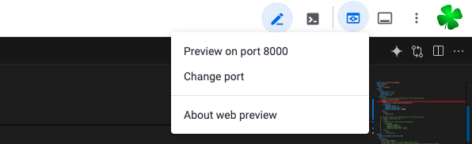
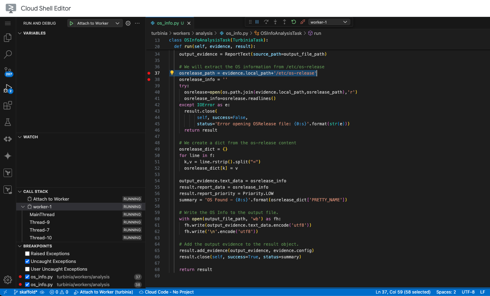
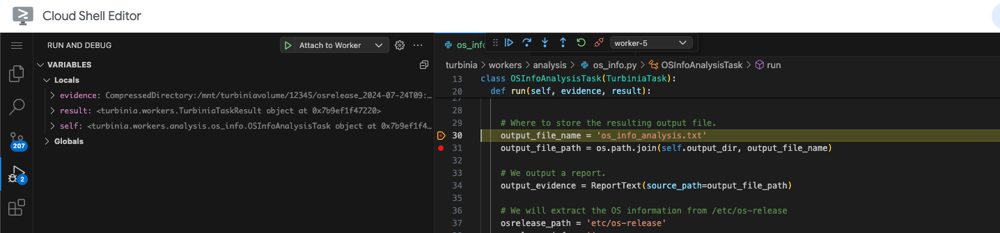

# Turbinia codelab 101 - analysers

This document is the Turbinia analyser codelab 101 using the new development environment based on minikube/skaffold with VSCode.

## Intro

We will write a very simple analyser for Turbinia that will detect the operating system to show you how to do a development flow with Turbinia including building, deploying and debugging. 

<<<<<<< HEAD
We will be using the Google Cloud Shell Editor which is a free system in the cloud which has all the dependencies setup and provides a web based VSCode editor. We will not be using any Google Cloud functionality so if you are more comfortable running this on your local computer please follow the setup instructions [here](develop-minikube.md) to setup a local Turbinia development environment before continuing.
=======
We will be using the Google Cloud Shell Editor which is a free system in the cloud which has all the dependencies setup and provides a web based VSCode editor. We will not be using any Google Cloud functionality so if you are more comfortable running this on your local computer please follow the setup instructions [here](https://github.com/google/turbinia/blob/master/docs/developer/develop-minikube.md) to setup a local Turbinia development environment before continuing.
>>>>>>> f11da4d (Add correct links to dev docs and minor improvements.)

## Reading

Read up on [how Turbinia works](https://turbinia.readthedocs.io/en/latest/user/how-it-works.html) and how to get started with [writing new tasks/analysers](https://turbinia.readthedocs.io/en/latest/developer/developing-new-tasks.html). We will run everything locally on minikube, so when reading the "how it works" page take note of the Local Architecture diagram.

## Prepare git work branch

Open up the [Cloud Shell Editor](https://ide.cloud.google.com/), fork the [Turbinia Github Repo](https://github.com/google/turbinia), clone your fork and create a new branch called `turbiniacodelab101`. Open up this folder in the [Cloud Shell Editor](https://shell.cloud.google.com/?pli=1\&show=ide\&environment\_deployment=ide). 

```
git clone https://github.com/your_github_name/turbinia.git && cd turbinia
git checkout -b turbiniacodelab101
```

Get the Turbinia Helm charts as described [here](https://github.com/google/turbinia/blob/master/docs/developer/develop-minikube.md#turbinia-source-and-deployment-code) and start minikube, the local k8s hypervisor.

```
$ minikube start
😄  minikube v1.33.1 on Ubuntu 22.04 (amd64)
✨  Automatically selected the docker driver. Other choices: ssh, none
📌  Using Docker driver with root privileges
👍  Starting "minikube" primary control-plane node in "minikube" cluster
🚜  Pulling base image v0.0.44 ...
💾  Downloading Kubernetes v1.30.0 preload ...
🔥  Creating docker container (CPUs=2, Memory=4000MB) ...
🐳  Preparing Kubernetes v1.30.0 on Docker 26.1.1 ...
🔗  Configuring bridge CNI (Container Networking Interface) ...
🔎  Verifying Kubernetes components...
🌟  Enabled addons: storage-provisioner, default-storageclass
🏄  Done! kubectl is now configured to use "minikube" cluster and "default" namespace by default
```

## Create analyser template files

We will add our new analyser name to the template configuration file. Add the following to `turbinia/config/turbinia_config_tmpl.py`

```

...
}, {
    'job': 'OSInfoAnalysisJob',
    'programs': ['grep'],
    'docker_image': None,
    'timeout': 3600
},
...
```

We will import our new job into the job management init code. Add the following to `​​turbinia/jobs/__init__.py`

```
from turbinia.jobs import os_info
```

We will add our new task name and import that task in the task management code. Add the task name to `turbinia/taskutils.py`

```
TASK_LIST = [
      ...
      'OSInfoAnalysisTask'
...
]
```

and in the same file in the function `gettask()` add

```
# Late imports to minimize what loads all Tasks
...
from turbinia.workers.analysis.os_info import OSInfoAnalysisTask
...
```

Create the boilerplate code for the job. Create a new file at `turbinia/jobs/os_info.py`

```
"""Job to execute os_info analysis task."""

from turbinia.evidence import CompressedDirectory
from turbinia.evidence import Directory
from turbinia.evidence import DockerContainer
from turbinia.evidence import GoogleCloudDisk
from turbinia.evidence import GoogleCloudDiskRawEmbedded
from turbinia.evidence import RawDisk
from turbinia.evidence import ReportText
from turbinia.jobs import interface
from turbinia.jobs import manager
from turbinia.workers.analysis import os_info


class OSInfoAnalysisJob(interface.TurbiniaJob):
  """Operating System Info analysis job."""

  evidence_input = [
      Directory, RawDisk, GoogleCloudDisk, GoogleCloudDiskRawEmbedded,
      CompressedDirectory, DockerContainer
  ]
  evidence_output = [ReportText]

  NAME = 'OSInfoAnalysisJob'

  def create_tasks(self, evidence):
    """Create task.
    Args:
      evidence: List of evidence objects to process
    Returns:
        A list of tasks to schedule.
    """
    tasks = [os_info.OSInfoAnalysisTask() for _ in evidence]
    return tasks


manager.JobsManager.RegisterJob(OSInfoAnalysisJob)

```

Create the actual analysis task code. Create a new file at `turbinia/workers/analysis/os_info.py`

```
"""Task for analysing Operating System Information."""

import os
from turbinia import TurbiniaException

from turbinia.evidence import EvidenceState as state
from turbinia.evidence import ReportText
from turbinia.lib import text_formatter as fmt
from turbinia.workers import Priority
from turbinia.workers import TurbiniaTask


class OSInfoAnalysisTask(TurbiniaTask):
  """Task to analyse Basic OS Information"""

  REQUIRED_STATES = [
      state.ATTACHED, state.CONTAINER_MOUNTED, state.DECOMPRESSED
  ]

  def run(self, evidence, result):
    """Run the OS Info worker.
    Args:
        evidence (Evidence object):  The evidence to process
        result (TurbiniaTaskResult): The object to place task results into.
    Returns:
        TurbiniaTaskResult object.
    """

    # Where to store the resulting output file.
    output_file_name = 'os_info_analysis.txt'
    output_file_path = os.path.join(self.output_dir, output_file_name)

    # We output a report.
    output_evidence = ReportText(source_path=output_file_path)

    # We will extract the OS information from os-release
    osrelease_path = os.path.join(evidence.local_path,'os-release')
    osrelease_info = ''
    try:
      osrelease=open(osrelease_path,'r')
      osrelease_info=osrelease.readlines()
    except IOError as e:
      result.close(
           self, success=False,
           status='Error opening OSRelease file: {0:s}'.format(str(e)))
      return result

    # We create a dict from the os-release content
    osrelease_dict = {}
    for line in osrelease_info: 
      k,v = line.rstrip().split("=") 
      osrelease_dict[k] = v

    output_evidence.text_data = os.linesep.join(osrelease_info) 
    result.report_data = os.linesep.join(osrelease_info)
    result.report_priority = Priority.LOW
    summary = 'OS Found - {0:s}'.format(osrelease_dict['PRETTY_NAME'])

    # Write the OS Info to the output file.
    with open(output_file_path, 'wb') as fh:
      fh.write(output_evidence.text_data.encode('utf8'))
      fh.write('\n'.encode('utf8'))

    # Add the output evidence to the result object.
    result.add_evidence(output_evidence, evidence.config)
    result.close(self, success=True, status=summary)

    return result
```

## Build and deploy analyser

As we are developing Turbinia Worker functionality we want to enable the worker profile as well in the skaffold configuration. So open `skaffold.yaml` and uncomment the Turbinia Worker sections. Both Server and Worker code should be uncommented.

```
...
...
artifacts:
    # Uncomment below when developing on the Turbinia Worker
    - image: turbinia-worker
      docker:
        dockerfile: docker/worker/Dockerfile
        buildArgs:
          TURBINIA_DEBUG: 1
          TURBINIA_HOTRELOAD: 1
          TURBINIA_DEBUG_PORT: 10000
      sync:
        infer:
        - turbinia/**
...
...
setValueTemplates:
        ## Uncomment below if doing worker development
        worker.image.repository: "{{.IMAGE_REPO_turbinia_worker}}"
        worker.image.tag: "{{.IMAGE_TAG_turbinia_worker}}@{{.IMAGE_DIGEST_turbinia_worker}}"

```

Now let's run the new code using skaffold to build and deploy the worker with our new OSInfoAnalysisJob and Task.   

NOTE: *The first time you run this command skaffold will build a custom worker image for you so this can take a while. Subsequent changes will try to use skaffold file syncing and hot-reloading and when that fails an incremental build will be done which is much faster.*

```
$ skaffold dev
```

When done building and deploying you will see the below message.

```
Thank you for installing turbinia.

Your release is named dev-release.

To learn more about the release, try:

  $ helm status dev-release
  $ helm get all dev-release

To connect to the Turbinia URL, run:
  
  $ kubectl --namespace default port-forward service/dev-release-turbinia 8000:8000
  $ echo "Visit http://127.0.0.1:8000 to access Turbinia"
  

Run the following commands on your workstation to orchestrate collection and processing of forensic data with dfTimewolf:
  $ git clone https://github.com/log2timeline/dftimewolf && cd dftimewolf
  $ pip3 install poetry
  $ poetry install && poetry shell
  $ dftimewolf -h
```

We do **not** need to install `dftimewolf` for this codelab. 

Sometimes the deployment goes wrong due to k8s dependency syncing issues. Try again with `skaffold dev`

Your Turbinia stack is now deployed with your new Job and Task. The stack can be seen by displaying the Pods.

```
$ kubectl get pods
NAME                                           READY   STATUS    RESTARTS      AGE
dev-release-redis-master-0                     1/1     Running   0             45s
dev-release-turbinia-api-7dfd8988b8-bprxd      1/1     Running   0             45s
dev-release-turbinia-server-5b6b47899-94z2m    1/1     Running   1 (22s ago)   45s
dev-release-turbinia-worker-577dcb8787-jvhqz   1/1     Running   0             45s

```

NOTE: *Install [k9s](https://k9scli.io/topics/install/) to make monitoring of your k8s cluster more convenient.*

You can take a look at the Turbinia WebUI by using the Web Preview functionality. Change the port to 8000 and the Turbinia WebUI loads in your browser.  



## Install Turbinia Client

Install the Turbinia Client as described [here](https://github.com/google/turbinia/blob/master/docs/developer/develop-minikube.md#install-the-turbinia-client)

## Adjust configuration file

As skaffold uses the default Turbinia Helm charts with default configuration we need to adjust the configuration for the deployment with our new configuration.

Download and write the current configuration file to the root of the Turbinia Helm chart folder.

```
$ turbinia-client config download > charts/turbinia/turbinia.conf
```

Add the new `OSInfoAnalyserJob` configuration to that file as well.

```
...
}, {
    'job': 'OSInfoAnalysisJob',
    'programs': ['grep'],
    'docker_image': None,
    'timeout': 3600
},
...
```

## Run, debug and fix analyser

Let's upload a test evidence file so we can run that through our analyser. We will use a .tgz file that contains a `/etc/os-release` file. You can download this file [here](../images/osrelease.tgz).

Now upload this evidence file to Turbinia giving a fake ticket ID `12345`.

```
$ turbinia-client evidence upload -p osrelease.tgz 12345
# /home/user/osrelease.tgz:
    * Original Name: osrelease.tgz
    * File Name: osrelease_2024-07-24T09:36:58.045255Z.tgz
    * File Path: /mnt/turbiniavolume/12345/osrelease_2024-07-24T09:36:58.045255Z.tgz
    * Size: 388
```

The file will now be available to Turbinia in `/mnt/turbiniavolume/12345/osrelease_2024-07-24T09:36:58.045255Z.tgz`

We can now submit a Turbinia request and we will only execute our new job to save on processing time.

```
$ turbinia-client submit compresseddirectory --jobs_allowlist OSInfoAnalysisJob --source_path /mnt/turbiniavolume/12345/osrelease_2024-07-24T09:36:58.045255Z.tgz

Sending request: {'evidence': {'type': 'CompressedDirectory', 'source_path': '/mnt/turbiniavolume/12345/osrelease_2024-07-24T09:36:58.045255Z.tgz'}, 'request_options': {'jobs_allowlist': ['OSInfoAnalysisJob']}}
Received response: {'request_id': '42d715d298c24e22ba1f4e88d25d4a44'}

```

We can check the status of the request in the Turbinia WebUI or via the cli. 

```
$ turbinia-client status request 42d715d298c24e22ba1f4e88d25d4a44
## Request ID: 42d715d298c24e22ba1f4e88d25d4a44
* Last Update: 2024-07-24T10:22:10.792302
* Requester: user_unspecified
* Reason:
* Status: completed_with_errors
* Failed tasks: 1
* Running tasks: 0
* Successful tasks: 1
* Task Count: 2
* Queued tasks: 0
* Evidence Name: /mnt/turbiniavolume/12345/osrelease_2024-07-24T09:36:58.045255Z.tgz
* Evidence ID: e45b1e39cbca4c8fb6716885a5f8c29f

### FinalizeRequestTask (MEDIUM PRIORITY): Completed successfully in 0:00:00.055258 on dev-release-turbinia-worker-6498c8cfd7-p7fmx
### OSInfoAnalysisTask (MEDIUM PRIORITY): Error opening OSRelease file: [Errno 2] No such file or directory: '/tmp/42d715d298c24e22ba1f4e88d25d4a44/1721816510-327203d3a5024040a20a27a4ba4a2ade-OSInfoAnalysisTask/uncompressed-1721816510/os-release'
```

## Debug analyser

So we ran into an error...let's debug

```
Error opening OSRelease file: [Errno 2] No such file or directory: '/tmp/42d715d298c24e22ba1f4e88d25d4a44/1721816510-327203d3a5024040a20a27a4ba4a2ade-OSInfoAnalysisTask/uncompressed-1721816510etc/os-release'
```

We seem to have incorrectly constructed the path to the `/etc/os-release` file.

Let's set two breakpoints (why only do 1, when you can have 2 ;) ) in our code to see what is going on and attach to the running worker.



And submit the same request again with the `turbinia-client`. The breakpoint hits, we can inspect variables at runtime and find where we made a mistake in our code.

 

Let's step through the code and keep an eye on how we build the evidence path to the `os-release` file. 

We made a typo in `osrelease_path`, it should be `'etc/os-release'`. Fixing and saving that in the source code file will sync and hot-reload the file to the running worker. 

Now let's submit a new request again.

```
$ turbinia-client submit compresseddirectory --jobs_allowlist OSInfoAnalysisJob --source_path /mnt/turbiniavolume/12345/osrelease_2024-07-24T09:36:58.045255Z.tgz
Sending request: {'evidence': {'type': 'CompressedDirectory', 'source_path': '/mnt/turbiniavolume/12345/osrelease_2024-07-24T09:36:58.045255Z.tgz'}, 'request_options': {'jobs_allowlist': ['OSInfoAnalysisJob']}}
Received response: {'request_id': 'e2eaf1c503234a7abef249e7d7f98c72'}

$ $ turbinia-client status request e2eaf1c503234a7abef249e7d7f98c72
## Request ID: e2eaf1c503234a7abef249e7d7f98c72
* Last Update: 2024-07-24T11:00:25.678296
* Requester: user_unspecified
* Reason:
* Status: successful
* Failed tasks: 0
* Running tasks: 0
* Successful tasks: 2
* Task Count: 2
* Queued tasks: 0
* Evidence Name: /mnt/turbiniavolume/12345/osrelease_2024-07-24T09:36:58.045255Z.tgz
* Evidence ID: 7e94770cbf08487db55061822da6545e

### FinalizeRequestTask (MEDIUM PRIORITY): Completed successfully in 0:00:00.060167 on dev-release-turbinia-worker-69d66788f-ftv9j
### OSInfoAnalysisTask (LOW PRIORITY): OS Found - "Ubuntu 22.04.4 LTS"
```

We fixed the bug and have a working analyser now, congratulations!


## Tips & Tricks

### Unexplainable reloads

Restart deployment with `skaffold dev` (ctrl-c the running instance)
