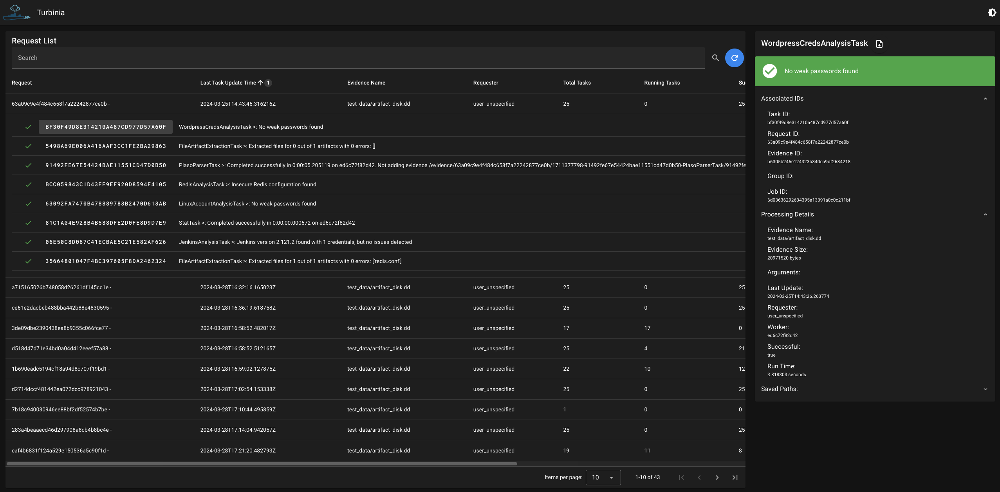

# Turbinia Web UI

The Turbinia Web UI helps track processing requests and allows users to search for specific request IDs, view associated
tasks, and download request/task output data. 

If you deploy Turbinia using the k8s deployment scripts, or the provided Dockerfile for the API server
there are no additional steps required to set up the Web UI.

If you are running your own development environment, you can build the UI by running ```npm run build```
within the turbinia/web directory.

Sample screenshot of the UI:

